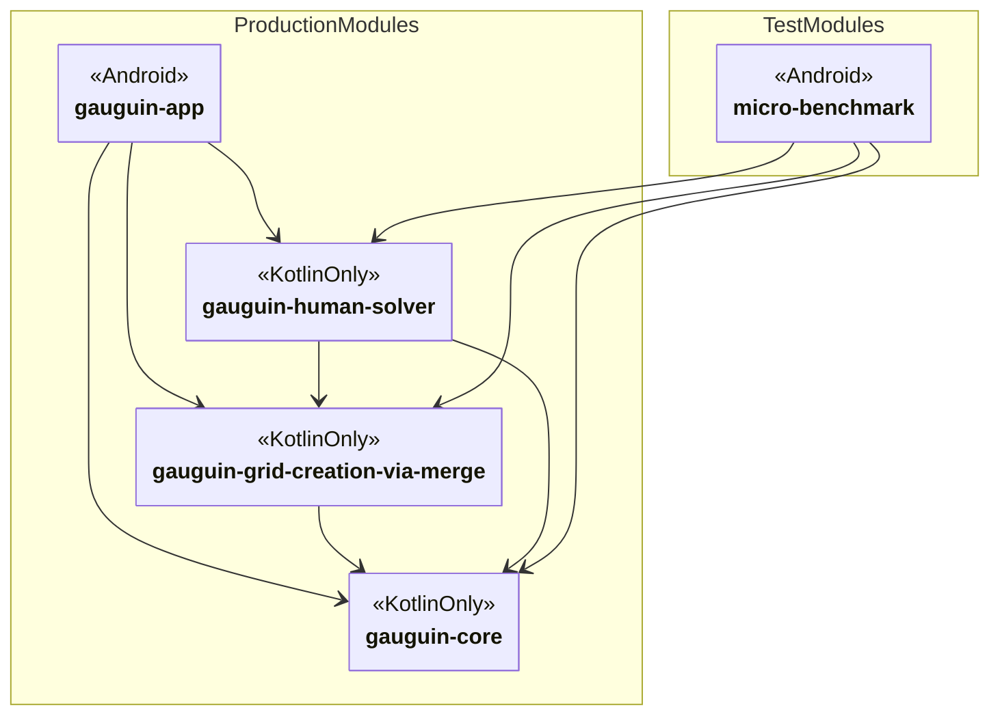

# Development

Gauguin uses, depends, builds on

* OS: Android
* language: Kotlin
* build system: Gradle
* UI: Material via XML (switching to Compose is a long term thing)

## Gradle modules

There are multple modules to separate the core logic from Android specific and/or UI specific code:

Plain Kotlin modules without any Android or ui related dependencies:

* gauguin-core: Core logic. 
* gauguin-grid-creation-via-merge: The new grid creator works via merging adjacent cages into one.
* gauguin-human-solver: The new difficulty detector, called 'human solver'.

Android-dependent modules:

* gauguin-app: Android app module using gauguin-core, Android SDK, AndroidX, Material Design
Components.
* micro-benchmark: Testing Android app module using AndroidX micro-benchmark lib to do performance
 tests.

## Build flags

These flags are passed to Gradle and are interpreted by custom Kotlin code included in Gradle Kotlin
DSL. To set this flag via Gradle wrapper, use e.g. for flag `buildserver`

    ./gradlew build -Pbuildserver

All flags default to false and may be activated to switch them to `true`. You can combine multiple
flags like this:

    ./gradlew build -Pbuildserver -Pscreenshot

### Flag buildserver

The build flag `buildserver` lets some tasks run long running stuff beeing used in CI builds only.
This triggers the following

| Value | Behaviour                                                                |
|-------|--------------------------------------------------------------------------|
| false | Deactivate Sonar as whole.                                               |
| true  | Activate Sonar, let Sonar depend on Android linter results (task `lint`) |

### Screenshot tests

`screenshot` needs to be set to activate screenshot tests. Without this flag, no screenshot test
will be run as they need quite some time.
