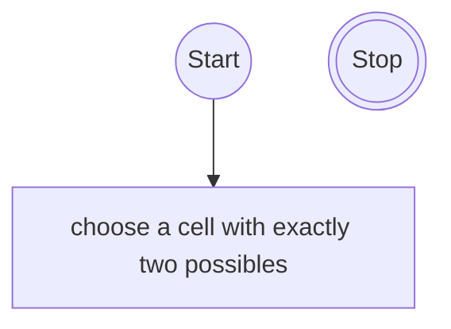

```mermaid
flowchart
    %%A[Square Rect] -- Link text --> B((Circle))
    %%A --> C(Round Rect)
    %%B --> D{Rhombus}
    %%C --> D
    %%id1{This is the text}
    D

    Start((Start))
    Stop(((Stop)))
    
    Start --> D[choose a cell with exactly two possibles]
    
```

Test